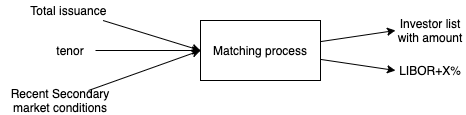
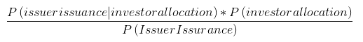
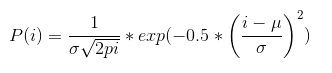
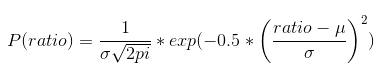
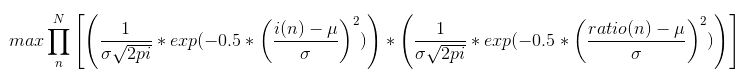
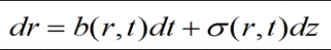

# AutoIBank

## Our business problem
An automated platform matches investors and Bond issuers at a particular fund raising size and price. <br>
The system models the Bond Issuance activities with Sales, Traders of a typical Investment Bank <br>
By analyzing huge trade data and market data, it shortens the fund raising analysis time with Banking and Market sides <br>
Also, with minimum human intervention, it enforces the segregation of duty and best execution offer to both investors and issuers. <br>
It features: <br>
1. system acting neutrally on the benefit between Banking and Market in Primary market <br>
2. referencing secondary market activities, finding the right price for issuers reference <br>
3. projecting the potential bond sales figure for different Bond issue price reflected from historical secondary market behavior<br>
4. finding potential investors in the Market behind of the Chinese wall of Banking <br>
 
### Workflow diagram


Under recent secondary market condition, <br>
a process would take input parameters:
1) $ Issuer issuance (total bond issuance amount)
2) tenor

System would output 
the list of potential investors with their interested auction amount in current secondary condition.
Also, the system would predict the possible yield 
e.g. LIBOR + X basis points 
for issuer reference.

### How to model the workflow?
A mathematical model would simulate a system workflow <br>
We start from simple using Bayne Inference. <br>

Under current Secondary market of tenor T e.g. 5Y <br>

A probability distribution of below is answer <br>
P(investor allocation | $Issuer issurance) <br>
We would search the investor allocation list from max probability value of above distribution <br>

The distribution is not trivial to understand. <br>
Bayne equation helps us to break down the problem into smaller problem to solve. <br>

The distribution can be expressed in Bayne equation <br>
 <br>

where <br>
Likelihood is P($issuer issuance | investor allocation) <br>
Prior probability is P(investor allocation) <br>

#### Assumption: <br>
Investors are taking Bond Ladder strategy to manage their portfolio. <br>
Therefore, they buy/sell certain tenor periodically of certain SIMILAR issuer to manage credit/interest risk exposure. <br>
With Bond Ladder assumption, we derive investor behavior easier from trading activities. <br>

1. Prior probability: P(investor allocation) <br>
It asks how likely investor spending X dollars on certain tenor T in secondary market
calculate from investor historical trading activities in secondary market on certain tenor in last 12 months. <br>
We ignore (buy/sell) flag. <br>
From the trade activities of a particular tenor, Gaussian distribution models the distribution of notional. <br>
For each investor, we find the mean, standard derivation from the notional of bond trades <br>
Note: we would normalize the mean, standard derivation <br>
 <br>

2. Likelihood : P($ issuer issuance | investor allocation) <br>
In a certain tenor T in secondary market, we find position ratio of holding issuer bond of each investor<br>
For each investor, having $x position in tenor T, how much they hold portion y in bond position issued by target issuer. <br>
We find the distribution of y/x=ratio in last 360 days <br>
 <br>

3. P($ issuer issuance) ... to be ignored.... <br>
P($ issuer issuance)  is the same for all investor allocation. <br>
As we want to compare different investor allocation to find max probability, we may ignore it.

#### Search for max probability 
Finally, within N investor, we search the largest probability giving largest: <br>
<br>
We look for investor allocation vector i(1), i(2)... i(N) to maximize above function<br>
where 
- Constraint: i(1)+i(2)+...+i(N) = target investor issuance amount <br>
- ratio(n) = i(n) / (total bond position of tenor T of investor n) <br>

It is a simple Gaussian cost function <br>
Next, we find the optimizer for this Gaussian cost function. <br>
With single constraint, Lagrange multiplier would be a potential candidate. <br>


#### Highlight
Equation will punish large N. If larger N, the probability product becomes smaller. <br>
Empirically, we would add a term  alpha * log (N) on cost function to give extra punishment. <br>
ratio in Likelihood applies limit on allocating excessive position to investor if they don't hold bond position of similar issuer before. <br>


>Reference: https://towardsdatascience.com/probability-concepts-explained-bayesian-inference-for-parameter-estimation-90e8930e5348 <br>
>Posterier distribution: https://en.wikipedia.org/wiki/Posterior_distribution 
to be addressed <br>

### Find the possible yield 
For finding possible yield, we can apply standard interest rate model. <br>
For example, applying short-rate model which is well known by the industry<br>
<br>
We would empirically take the simpliest form in the beginning.

---
## System run
### How to run the secondary market analysis component?
Implementation is with Kafka and Apache Dataflow. <br>
Now, we run a dummy trade generator of 10 investors for testing purpose

#### Direct Runner
Build command:
```
gradle -Pdirect clean build
```


#### Kafka dependency
##### Modules:
SecondaryMarketGateway - Publisher
SecondaryMarketAnalysis - Subscriber

Installation of Kafka
https://kafka.apache.org/quickstart
##### Start Kafka
````
rm -Rf /tmp/zookeeper
rm -Rf /tmp/kafka-logs
zookeeper-server-start.sh $KAFKA_HOME/config/zookeeper.properties & 
sleep 10
kafka-server-start.sh $KAFKA_HOME/config/server.properties 
````
##### Stop Kafka
````
zookeeper-server-stop.sh  & 
sleep 2
kafka-server-stop.sh 
sleep 2
rm -Rf /tmp/zookeeper
rm -Rf /tmp/kafka-logs
````

##### Create of topic - bondtrade
````
kafka-topics.sh --create --bootstrap-server localhost:9092 --replication-factor 1 --partitions 1 --topic bondtrade
````

##### Health check
````
kafkacat -b localhost:9092 -P -t bondtrade 
kafkacat -b localhost:9092 -C -t bondtrade
````

##### Gateway Run
````
java -jar SecondaryMarketGateway/build/libs/SecondaryMarketGateway-1.0-SNAPSHOT.jar -k localhost:9092 -t bondtrade
````
##### Analysis Run
````
java -jar SecondaryMarketAnalysis/build/libs/SecondaryMarketAnalysis-1.0-SNAPSHOT.jar 
````